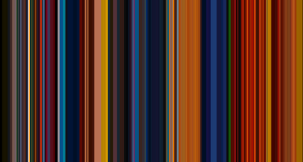
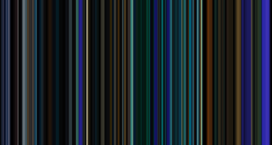

# HSM3

`HSM3` implements the Hasler and Süsstrunk M3 metric of image colourfulness (Hasler and Süsstrunck 2003). 

The M3 metric is a linear combination of the mean and standard deviation of an opponent sRGB colour space defined by  and . The M3 metric is then calculated as 

where 

and

.

The interpretation of the metric is based on a category scaling experiment in which subjects rate the colourfulness attributes of images, with the following values of the M3 metric assigned to colourfulness attributes: 

* not colourful = 0
* slightly colourful = 15
* moderately colourful = 33
* averagely colourful = 45
* quite colourful = 59
* highly colourful = 82
* extremely colourful = 109.

## Example
The only argument for `HSM3` is `x`, which is an image in the namespace loaded using `imager::load.image`.

To illustrate the fucntion we can compare the colourfulness of the [smoothed barcodes](https://zerowidthjoiner.net/movie-barcode-generator) for the trailers to *The Lego Batman Movie* and *John Wick: Chapter 3 - Parabellum*.

_**The Lego Batman Movie**_ 

_**John Wick: Chapter 3 - Parabellum**_ 

The barcode of the trailer for *The Lego Batman Movie* has a colourfullness of 91.3, classing it as 'highly colourful,' whereas the trailer for *John Wick: Chapter 3* has a colourfulness of 42.8, which is almost 'averagely colourful.'

## References
Hasler, D. and Süsstrunk, S. E. (2003) Measuring colorfulness in natural images, Proc. IS&T/SPIE Electronic Imaging 2003: Human Vision and Electronic Imaging VIII (17 June 2003) 5007: 87-95. https://doi.org/10.1117/12.477378.
